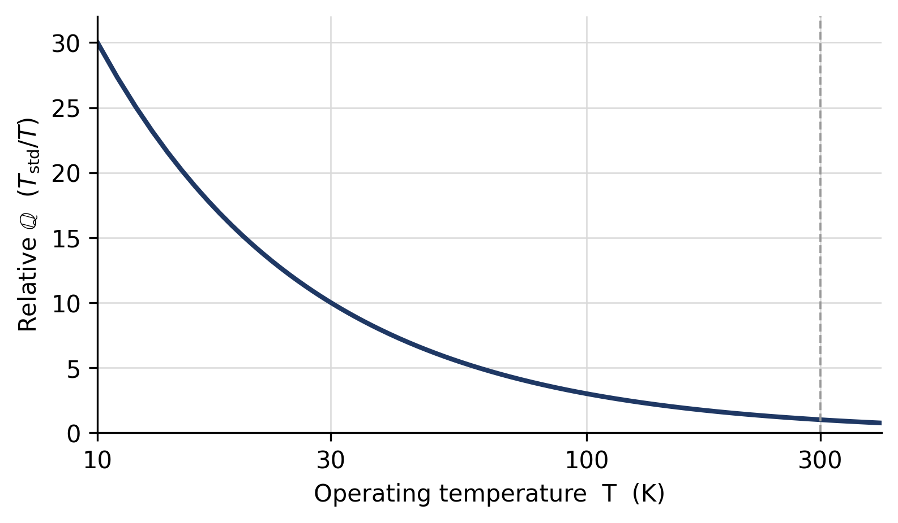

*Keywords: compute energy efficiency, Landauer limit, Shannon entropy, performance-per-watt, Green500, confidential computing, sustainable computing.*

# Introduction: The Measurement Problem

Computation is a physical process bounded from below by thermodynamics: Landauer's principle fixes the minimum energy to irreversibly erase one bit at $k_B T \ln 2$, about $2.9\times10^{-21}$ J at 300 K [1]. Energy has also become the binding constraint on computing in practice. Data centers drew roughly 415 TWh in 2024—about 1.5% of world electricity—and the International Energy Agency projects this to roughly double to about 945 TWh, near 3% of global demand, by 2030, with the AI-specific share set to more than triple [2]. Efficiency—useful work per joule—is now the figure that decides how much computation can be deployed.

Yet the metrics in common use do not measure it. FLOPS and TOPS count operations without reference to the information those operations resolve or the energy they cost; the energy-delay product compares only within one hardware family; PUE and carbon intensity are facility-level. None expresses how far a computation runs from its physical floor, and none is comparable across the substrate diversity—CPU, GPU, and emerging photonic and quantum hardware—that now matters. This paper proposes the Quant (ℚ) to fill that gap: a single, substrate-independent unit of computational energy efficiency.

**Contributions.** (i) An operational, measurable definition of ℚ for classical hardware (§3); (ii) a bounded thermodynamic-efficiency ratio $\eta \in (0,1]$ that anchors ℚ to the Landauer limit (§3.2); (iii) two scaling laws, for temperature and arithmetic precision (§4); (iv) a measurement protocol that treats the confidentiality–attestation tension as a first-class problem (§6); and (v) the coupling to DUCP, where ℚ is recorded per task (§7). To our knowledge, ℚ is the first proposed compute-efficiency unit that is at once substrate-independent, Landauer-normalized, and defined to be measured rather than asserted.

# Deficiencies in Legacy Metrics

**FLOPS and TOPS count, they do not weigh.** A tensor-core accelerator advertised at, say, 1000 TOPS in 8-bit precision performs an enormous number of operations, but the information *resolved* per joule—and thus the useful work—is far smaller and is invisible in the headline figure. Low-precision and redundant operations inflate the count without a commensurate increase in resolved information. ℚ corrects this by anchoring to resolved information rather than to operation count.

**EDP and facility metrics do not cross boundaries.** The energy-delay product is meaningful only within a single CMOS family. PUE, carbon intensity, and tokens-per-joule are engineering- or facility-specific and say nothing about distance from the physical limit. They are useful operationally but cannot serve as a common, cross-substrate unit.

# Definition and Foundation

## Operational (classical) definition

The form of ℚ usable on today's silicon is

$$ 1\,\mathbb{Q} \;\equiv\; \frac{C \times E_{\mathrm{baseline}} \times T_{\mathrm{std}}}{E_{\mathrm{consumed}} \times T}, $$

where $C$ is the count of useful operations the task performed; $E_{\mathrm{baseline}}$ and $T_{\mathrm{std}}$ are the reference energy and standard junction temperature published by a benchmark authority; $E_{\mathrm{consumed}}$ is the energy the task actually drew; and $T$ is the operating junction temperature in kelvin. $T$ is a temperature, not a time—there is no time term in ℚ. Higher ℚ means more useful computation resolved per normalized joule. The normalization to a moving reference (§5) makes ℚ a dimensionless efficiency score that is comparable across machines and stable as the field advances.

## The Landauer floor and bounded efficiency

To ground the unit physically, let a task irreversibly resolve $B$ bits of information. Landauer's principle sets its minimum energy at $E_{\min} = B\,k_B T \ln 2$, and we define a bounded thermodynamic efficiency

$$ \eta \;=\; \frac{E_{\min}}{E_{\mathrm{consumed}}} \;=\; \frac{B\,k_B T \ln 2}{E_{\mathrm{consumed}}} \;\in\; (0,1]. $$

Here $\eta = 1$ is the physical floor (perfect, Landauer-limited operation) and $\eta < 1$ holds for all irreversible hardware. The bound is important: it makes "efficiency" a ratio against a limit that cannot be beaten, so no honest measurement may imply $\eta > 1$, and an implausibility check can reject any that does. (Reversible and adiabatic architectures are not bounded by $E_{\min}$ in the same way and lie outside the scope of this classical definition [11]; the resolved-bit count $B$ used here is distinct from the operation count $C$ in the ℚ ratio, and the two must not be conflated.)

The headroom this exposes is large. The most efficient machine on the November 2025 Green500 list resolves work at roughly 13.7 pJ per floating-point operation [3]; current accelerators thus operate on the order of $10^{9}$ times above the Landauer floor. Efficiency, not raw throughput, is where the next orders of magnitude remain.

# Scaling Laws

## Temperature

Holding resolved work fixed, the Landauer normalization makes ℚ vary inversely with operating temperature, $\mathbb{Q} \propto T_{\mathrm{std}}/T$. Relative to the 300 K reference, cryogenic operation at 10 K yields a factor of $300/10 = 30$ (Figure 1). This is the thermodynamic basis for the efficiency interest in cold computing; it is a property of the normalization, not a claim that any present system approaches the floor.

{width=88%}

## Arithmetic precision

Useful information per operation also depends on numerical precision. Modeling the resolved information at bit width $b$ by its Shannon content [10] gives

$$ \mathbb{Q}(b) \;=\; \mathbb{Q}_0 \cdot \frac{H(b)}{b \log_2 e}, $$

which captures that lower-precision arithmetic resolves less effective information per operation. As a first-order estimate this predicts roughly a $1.8\times$ change in effective efficiency between FP16 and FP8—useful as an illustration of the mechanism, pending empirical regression on real workloads.

# Baseline Evolution

$E_{\mathrm{baseline}}$ is not a fixed constant; it is pegged to the state of the art and tightened on each Green500 release, so that ℚ measures distance from the current frontier rather than from a stale reference. This keeps the unit honest as hardware improves: a score that would have been excellent against a 2020 baseline is re-scored against the present one. The update rule is a normative part of the standard.

# Measurement Protocol

## Reference (laboratory) measurement

Certification of a ℚ rating in a laboratory follows a defined procedure: fix a control volume; run a certified, representative workload; record energy with a revenue-grade power analyzer ($\pm 0.1$–$0.5\%$, NIST-traceable) and junction temperature with on-die sensors; stabilize at 300 K or apply a Carnot correction; and report ℚ with a combined uncertainty budget (target $\le 2\%$) over repeated runs. This is reference-grade and reproducible, and it is the basis for rated, published ℚ values.

## The confidentiality–attestation obstacle

The harder problem is measuring ℚ *per task, on untrusted hardware, without a trusted laboratory*—the setting any decentralized or audited deployment requires. Two facts make this difficult. First, everyday on-die telemetry is coarse: RAPL carries 5–10% error, and at least one widely used GPU power interface samples only about a quarter of runtime, badly mis-estimating short kernels [4]. Second, and decisively, the moment a workload runs inside a confidential-computing enclave, fine-grained power telemetry is deliberately suppressed, because power draw is a recognized side channel: NVIDIA confidential-computing mode disables performance counters [5], Intel forces modeled rather than measured energy under SGX (the PLATYPUS mitigation) [6], and AMD SEV-SNP can disable power reporting per VM [7]. No deployed standard signs a live power value. Trustless measurement and trustworthy measurement are, today, in direct tension.

## Bounding instead of measuring

The practical resolution, developed in the companion DUCP protocol, is to *bound* energy rather than measure it. A static power cap is hardware configuration, not data-dependent telemetry—side-channel-safe by construction, and exactly the kind of fact hardware attestation already signs. If a device completes a known task under an attested power cap within an observed time window, the cap times the window upper-bounds the energy, the rated maximum junction temperature upper-bounds the temperature, and the two together yield a provable *lower bound* on ℚ with no energy telemetry at all. Completion under constraint is the measurement. This "Sealed Power Proof" degrades gracefully—a corrupted claim can inflate efficiency by at most the ratio of the rated maximum to the true cap, whereas fabricated telemetry is unbounded—and it grades from evidence available today up to a vendor-locked power register, which is the one concrete hardware request this standard makes of silicon vendors.

# Relationship to DUCP

ℚ is the quality axis of a two-axis model of computation: a companion unit, 𝕌 (the Universal Compute Unit), measures *how much* useful work was delivered, while ℚ measures *how cleanly*. In the DUCP protocol [9], 𝕌 is the metered, rewarded unit of work, and ℚ is specified as a reward-neutral observable recorded for every settled task—measured and made legible, but never affecting payment, so that no older device, hot climate, or constrained region is ever penalized. DUCP depends only on the classical, Landauer-bounded definition of Sections 3–6. The Sealed Power Proof is the mechanism by which DUCP records ℚ trustlessly, and the vendor-locked power register is the joint hardware ask of both efforts.

# Illustrative Comparison

Table 1 sketches how ℚ reorders representative accelerators relative to a marketing throughput-per-watt figure. The values are *illustrative only*: rigorous entries require MLPerf-style runs with NIST-traceable power and temperature logs and full uncertainty propagation, which this draft does not yet provide. The qualitative point is the one that matters here—throughput-per-watt and Landauer-normalized efficiency are different orderings, and only the latter reveals distance from the physical limit.

| System | Marketed perf/W | Relative ℚ (illustrative) |
|:---|:---:|:---|
| Modern training GPU | very high (FP8) | moderate |
| Inference ASIC (tokens) | high | higher (token-entropy) |
| Cryogenic / novel substrate | lower today | high (thermal factor) |

Table: Illustrative ℚ vs. throughput-per-watt (pending validated benchmarks).

# Sustainability Significance

A common, physically grounded efficiency unit serves three concrete purposes that facility metrics cannot. It lets perf-per-watt be *compared* across substrates and vendors on equal terms; it gives sustainability-bound and regulated buyers—for example those reporting under the Software Carbon Intensity standard, ISO/IEC 21031:2024 [8]—a basis for sourcing *provably* efficient compute rather than self-declared marketing; and it turns the roughly billion-fold headroom above the Landauer floor into a measurable target rather than an abstraction. We make no quantitative global-savings projection here; such figures depend on adoption and workload mix and are left to future empirical work.

# Conclusion

The Quant is a substrate-independent, Landauer-normalized unit of computational energy efficiency, defined to be measured rather than asserted. Its near-term value does not depend on any speculative extension: the classical definition, the bounded efficiency $\eta \in (0,1]$, the temperature and precision scaling laws, and the bound-don't-measure protocol are usable on today's hardware and couple directly to DUCP. The open work that matters most is empirical—validated benchmark entries with traceable power and temperature logs, regression on the precision scaling law, and the vendor-attested locked power cap that would make the strongest measurement grade exact. Because ℚ is substrate-independent, emerging substrates—photonic and quantum among them—are natural future subjects for measured, traceable ℚ ratings once power and temperature logs exist.

# Acknowledgment {-}

An AI assistant was used for drafting, equation formatting, and figure generation; the technical content and the core ideas are the author's. This v0.4 revision narrows the proposal to its rigorous, empirically grounded core—removing earlier speculative material so that every claim is grounded in established physics and measurable on present or near-term hardware.

# Licensing & Ownership {-}

© 2026 Pawan Singh. All rights reserved except as expressly granted. This document is licensed under Creative Commons Attribution–NonCommercial–NoDerivatives 4.0 International (CC BY-NC-ND 4.0): it may be read, shared, and cited verbatim with attribution for non-commercial purposes; no derivatives or commercial use without written permission. "Quant" and the Quant (ℚ) mark are trademarks of the author. The Quant standard and DUCP are owned and stewarded by the author through the pre-1.0 phase. This notice is informational, not legal advice.

# References {-}

[1] R. Landauer, "Irreversibility and Heat Generation in the Computing Process," *IBM J. Res. Dev.*, 1961.

[2] International Energy Agency, "Energy and AI" (World Energy Outlook Special Report), 2025.

[3] TOP500 Project, "The Green500 List," November 2025.

[4] Z. Yang, K. Adamek, and W. Armour, "Part-time Power Measurements: nvidia-smi's Lack of Attention," *Proc. SC'24*, 2024.

[5] NVIDIA, "Confidential Compute on NVIDIA Hopper H100," Whitepaper WP-11459-001, 2023.

[6] M. Lipp et al., "PLATYPUS: Software-based Power Side-Channel Attacks on x86," *IEEE S&P*, 2021 (Intel RAPL mitigation INTEL-SA-00389).

[7] AMD, "Power Side-Channel Vulnerabilities," Security Bulletin AMD-SB-3004 (SEV-SNP power-reporting controls).

[8] Green Software Foundation, "Software Carbon Intensity (SCI)," ISO/IEC 21031:2024.

[9] P. Singh, "Decentralized Universal Compute Protocol (DUCP): Technical White Paper," v0.1.0, 2026.

[10] C. E. Shannon, "A Mathematical Theory of Communication," 1948.

[11] C. H. Bennett, "The Thermodynamics of Computation," 1982.
